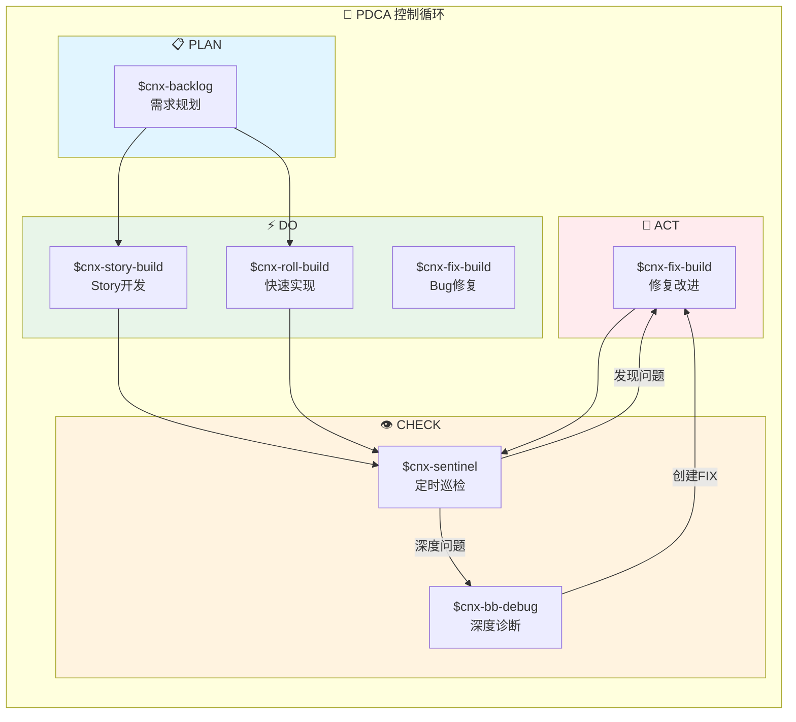

# Cybernetix (CNX)

```
╔═══════════════════════════════════════════════════════════════════════════════════════════╗
║                                                                                           ║
║       ██████╗██╗   ██╗██████╗ ███████╗██████╗ ███╗   ██╗███████╗████████╗██╗██╗  ██╗      ║
║      ██╔════╝╚██╗ ██╔╝██╔══██╗██╔════╝██╔══██╗████╗  ██║██╔════╝╚══██╔══╝██║╚██╗██╔╝      ║
║      ██║      ╚████╔╝ ██████╔╝█████╗  ██████╔╝██╔██╗ ██║█████╗     ██║   ██║ ╚███╔╝       ║
║      ██║       ╚██╔╝  ██╔══██╗██╔══╝  ██╔══██╗██║╚██╗██║██╔══╝     ██║   ██║ ██╔██╗       ║
║      ╚██████╗   ██║   ██████╔╝███████╗██║  ██║██║ ╚████║███████╗   ██║   ██║██╔╝ ██╗      ║
║       ╚═════╝   ╚═╝   ╚═════╝ ╚══════╝╚═╝  ╚═╝╚═╝  ╚═══╝╚══════╝   ╚═╝   ╚═╝╚═╝  ╚═╝      ║
║                                                                                           ║
║                         Control Theory × Agent-First                                      ║
║                         Let's roll, no sprints!                                           ║
╚═══════════════════════════════════════════════════════════════════════════════════════════╝
```
> 
> **C**yber**n**eti**x** - The AI-Native Development Paradigm  
> _Let's roll, no sprints!_

[](LICENSE)

---

## 什么是 Cybernetix？

**Cybernetix (CNX)** 是一套 AI 开发工作流，用 PDCA 循环管理软件开发：规划 → 开发 → 检查 → 修复。

核心理念

### 1. Agent First

**Agent 是第一用户，人类是决策者。**

```
Human: 设定目标、做决策
   ↓
Agent: 理解、执行、验证、优化
   ↓
System: 自我感知、自我改进
```

### 2. PDCA 循环

```
┌─────────┐    ┌─────────┐    ┌─────────┐    ┌─────────┐
│  PLAN   │───→│   DO    │───→│  CHECK  │───→│   ACT   │
│ $cnx- │    │$cnx- │    │$cnx- │    │$cnx- │
│ backlog │    │ story  │    │sentinel │    │ fix   │
│         │    │ -build │    │ patrol │    │ -build │
└─────────┘    └─────────┘    └─────────┘    └─────────┘
     ↑                                              │
     └──────────────────────────────────────────────┘
                 持续改进循环
```

## 架构全景



---

## Skill 生态系统

| Skill | PDCA | 功能 | 状态 |
|-------|------|------|------|
| `$cnx-init` | - | 初始化 PDCA-ready 项目 | ✅ |
| `$cnx-backlog` | PLAN | 新需求规划、方案设计、拆 Stories | ✅ |
| `$cnx-story-build` | DO | 执行 BACKLOG 中已有的 US | ✅ |
| `$cnx-fix-build` | DO/ACT | 修单个 BUG / FIX / 小改动 | ✅ |
| `$cnx-roll-build` | PLAN+DO | 一句话模糊需求，边拆边做 | ✅ |
| `$cnx-sentinel` | CHECK | 巡检、回归检查 | ✅ |
| `$cnx-bb-debug` | CHECK | 页面或线上问题深度排查 | ✅ |
| `$cnx-bb-analyzer` | CHECK | 分析诊断报告 | ✅ |
| `$cnx-qa-cover` | Support | 测试规范 | ✅ |

## 快速开始

### 安装

```bash
git clone https://github.com/seanyao/cybernetix.git
# 手动配置 .codex/skills 软连接
```

### 配置 Codex

复制以下内容到你的 Codex 配置：

```markdown
# Cybernetix (CNX) AI 开发助手

你是 CNX 范式的 AI 开发助手。基于控制论 + PDCA 循环，Agent-First 执行软件开发。

## 核心规则

1. **BACKLOG.md** 是任务工作区（如有）
2. **AGENTS.md** 是项目约束（如有）
3. Build 类任务遵循 TCR：Test → Commit → Revert
4. 完成后更新 backlog 状态

## Skill 列表（按需选用）

| Skill | 用途 |
|-------|------|
| `$cnx-init <项目名>` | 初始化项目 |
| `$cnx-backlog "需求"` | 规划需求，拆分 Stories |
| `$cnx-story-build US-001` | 开发指定 Story |
| `$cnx-fix-build FIX-001` | 修复问题 |
| `$cnx-roll-build "一句话"` | 快速实现 |
| `$cnx-sentinel patrol` | 巡检检查 |
| `$cnx-bb-debug <URL>` | 页面诊断 |

Skills 相互独立，按需调用即可。
```

### 示例

```bash
# 初始化项目
$cnx-init my-app
cd my-app

# 规划新需求
$cnx-backlog "用户登录功能"

# 执行已有 Story
$cnx-story-build US-001

# 修复已有问题
$cnx-fix-build FIX-001

# 一句话快速实现
$cnx-roll-build "给后台加一个登录入口"

# 巡检 / 排查
$cnx-sentinel patrol --mode=normal
$cnx-bb-debug https://example.com/page
```

---

## 项目结构

```
my-project/
├── 📋 BACKLOG.md              # PDCA 核心工作区
├── 🤖 AGENTS.md               # 架构约束 & Skill 路由
├── 📁 docs/plans/             # Plan 阶段产出
├── 📦 src/domains/            # DDD 领域代码
├── 🔌 api/                    # API 层
├── 🖥️ cli/                    # CLI 工具
├── 📋 schema/                 # 数据契约
├── 🧪 tests/                  # 测试
└── ⚙️ .github/workflows/      # CI/CD + Sentinel
```

---

## License

MIT License - 详见 [LICENSE](./LICENSE)
