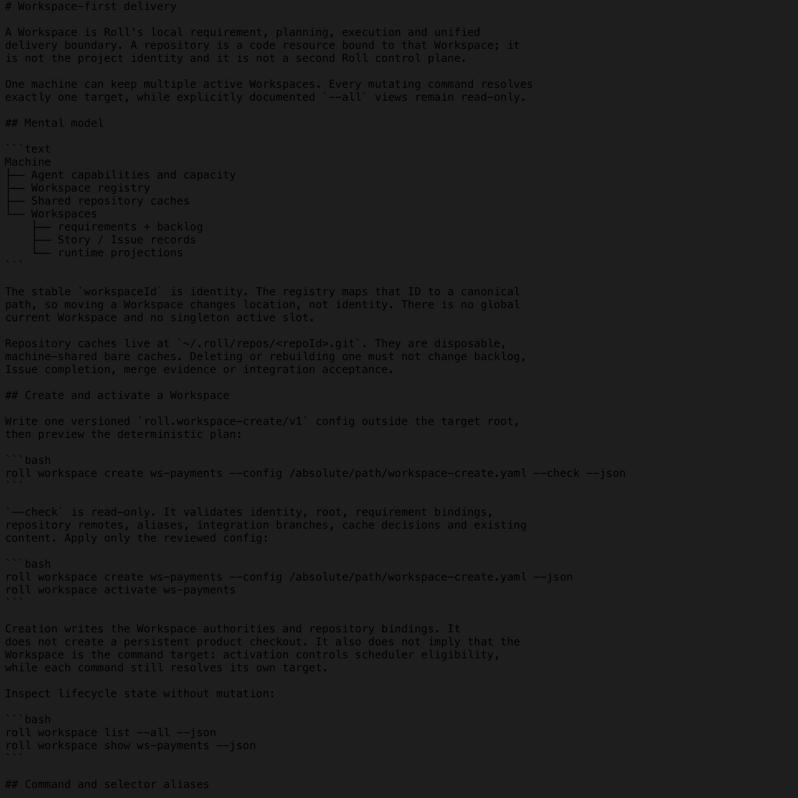
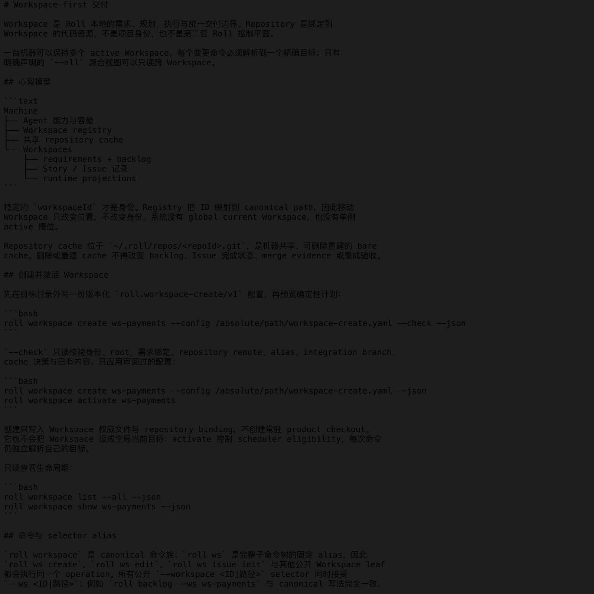
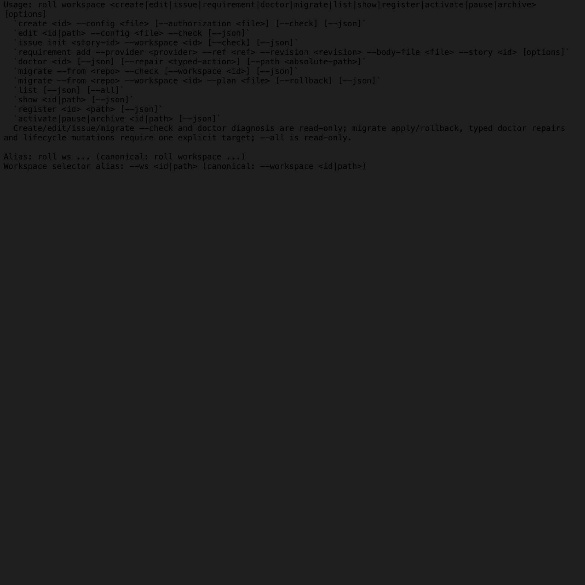
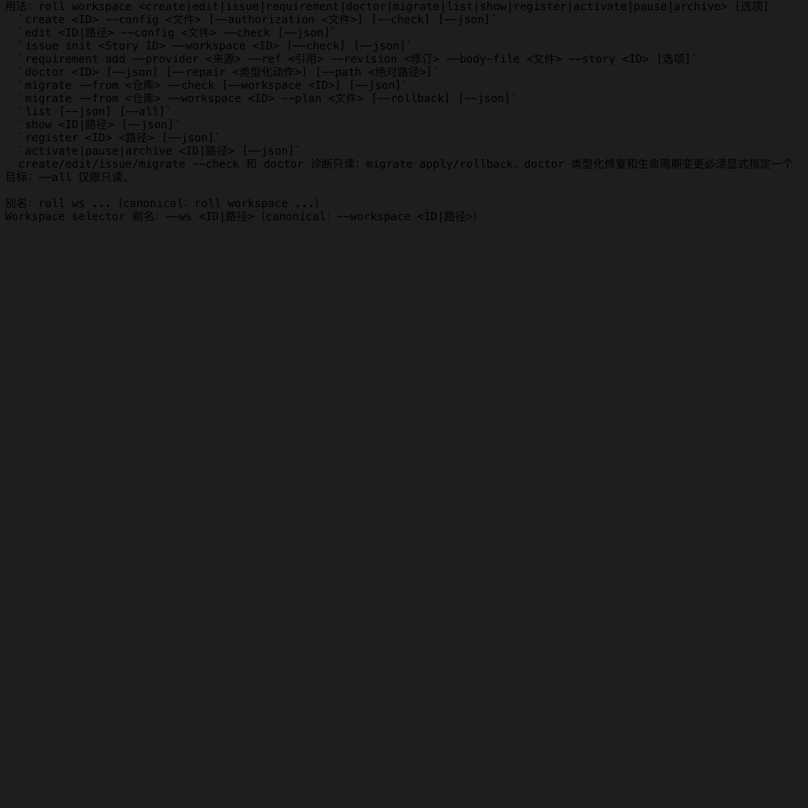

# US-WS-041 documentation evidence

This directory records the reviewed English and Chinese Workspace guide surfaces
and the real CLI help shown for both canonical and alias entry points.

## Sources

- `workspaces-en.png`: Quick Look preview of `guide/en/workspaces.md`
- `workspaces-zh.png`: Quick Look preview of `guide/zh/workspaces.md`
- `workspace-help-en.png`: Quick Look preview of the captured English help
- `workspace-help-zh.png`: Quick Look preview of the captured Chinese help

All images are 1600 by 1600 PNG files rendered locally with macOS Quick Look.
Quick Look was used as the safe non-browser renderer because the browser rejects
local `data:` navigation by policy.

## Reproduce terminal evidence

Capture the real command output from the CLI under test:

```bash
ROLL_LANG=en node packages/cli/bin/roll.js workspace --help \
  > packages/cli/test/fixtures/workspace/us-ws-041-terminal-evidence/workspace-help.en.txt
ROLL_LANG=zh node packages/cli/bin/roll.js ws --help \
  > packages/cli/test/fixtures/workspace/us-ws-041-terminal-evidence/workspace-help.zh.txt
```

The `workspace-context-docs.test.ts` suite also invokes `workspace --help` and
`ws --help` through the production dispatcher. It requires canonical and alias
results to be identical and compares each locale byte-for-byte with the captured
fixture before accepting this evidence.

## Reproduce previews

Render a source or captured transcript with Quick Look, then preserve the
generated preview as the corresponding PNG in this directory:

```bash
qlmanage -t -s 1600 -o /tmp/roll-us-ws-041-preview guide/en/workspaces.md
qlmanage -t -s 1600 -o /tmp/roll-us-ws-041-preview \
  packages/cli/test/fixtures/workspace/us-ws-041-terminal-evidence/workspace-help.en.txt
```

Repeat for the Chinese sources. The screenshots are review evidence only; the
Markdown sources, captured transcripts and executable tests remain authoritative.

## Preview index

### English Workspace guide



### Chinese Workspace guide



### English CLI help



### Chinese CLI help


